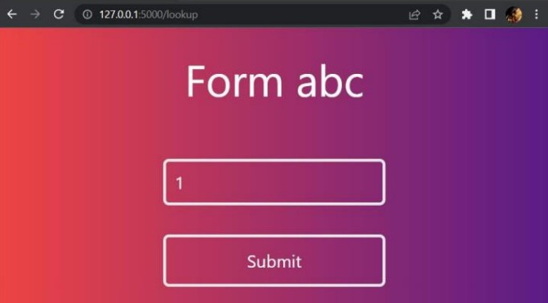

# Sreenath S (20BCE1450) PBL-2

## **Final Demo**

1. **Home Page with .json file of form returned**


2. **Form generated using input fields**


    _On submit_
    ```
        { "Submitted": true }
    ```

    Sample of Data in encrypted form for _database_name.csv_ :
    ```
        ID,Name
        1/w/+WzW5ad6RWd1cKDxgA==,aMRwPkvdpLEtTNQX5uZGFg==
    ```
    Here two fields have been taken namely ID and Name.

3. **Fetching data**


    On submit
    ```
    { "ID":"1", "Name":"sree"}
    ```
3. **Documentation website**

